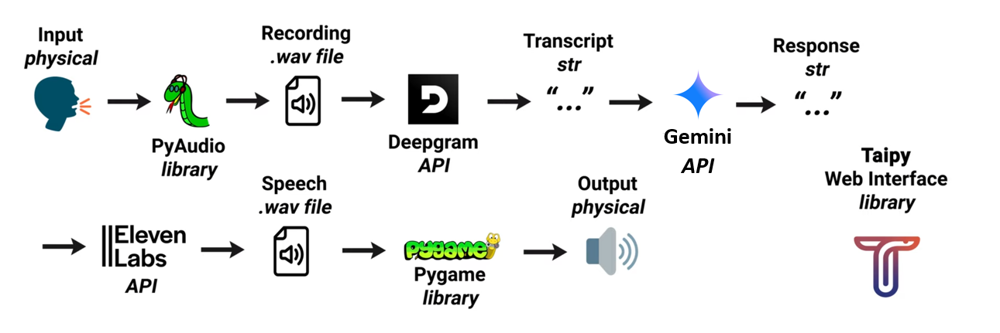

# Nova - Smart Voice Assistant


> A powerful, real-time voice assistant built with Python that combines speech recognition, AI conversation, and text-to-speech in an elegant web interface.

**Created by:** PVB Adithya  
**Contact:** adithya.vprata@gmail.com  
**LinkedIn:** [https://www.linkedin.com/in/pvba/](https://www.linkedin.com/in/pvba/)  
**GitHub:** [https://github.com/pvba-py](https://github.com/pvba-py)

---

## Table of Contents

- [Demo](#demo)
- [Features](#features)
- [Quick Start](#quick-start)
  - [Prerequisites](#prerequisites)
  - [Installation](#installation)
  - [Usage](#usage)
- [Project Structure](#project-structure)
- [Configuration](#configuration)
  - [Voice Settings](#voice-settings)
  - [Performance Optimizations](#performance-optimizations)
- [Use Cases](#use-cases)
- [Technical Details](#technical-details)
  - [Core Technologies](#core-technologies)
  - [Performance Metrics](#performance-metrics)
- [Security & Privacy](#security--privacy)
- [Exit Commands](#exit-commands)
- [How Nova Works - Step by Step](#how-nova-works---step-by-step)
- [Contributing](#contributing)
- [License](#license)
- [Inspiration & Credits](#inspiration--credits)
- [Acknowledgments](#acknowledgments)
- [Troubleshooting](#troubleshooting)
- [Support](#support)
- [Roadmap](#roadmap)
- [Contact & Connect](#contact--connect)

---

## Demo

Nova processes voice commands in real-time with impressive speed:

```
 User: "What's the weather like today?"
 Nova: "I'd recommend checking your local weather app for current conditions!"
 Total Response Time: ~4.2 seconds
```

**Performance Highlights:**
- Speech Recognition: ~2.1s (Deepgram Nova-2)
- AI Processing: ~0.8s (Google Gemini 2.0 Flash) 
- Audio Generation: ~1.3s (ElevenLabs)

## Features

- **Voice Recognition**: Advanced speech-to-text using Deepgram Nova-2 model
- **AI Conversations**: Powered by Google Gemini 2.0 Flash for fast, intelligent responses
- **Natural Speech**: High-quality text-to-speech with ElevenLabs voices
- **Real-time Chat**: Beautiful web interface built with Taipy framework
- **Optimized Performance**: Sub-second response times with smart conversation context
- **Modern UI**: Purple gradient theme with professional styling
- **Live Updates**: Real-time conversation display without page refresh

## Quick Start

### Prerequisites

- Python 3.8+
- Microphone access
- API keys for:
  - [Deepgram](https://deepgram.com/) (Speech Recognition)
  - [Google Gemini](https://ai.google.dev/) (AI Responses)
  - [ElevenLabs](https://elevenlabs.io/) (Text-to-Speech)

### Installation

1. **Clone the repository**
   ```bash
   git clone https://github.com/pvba-py/Nova---Voice-Assistant-.git
   cd Nova---Voice-Assistant-
   ```

2. **Create virtual environment**
   ```bash
   python -m venv venv
   venv\Scripts\activate  # Windows
   # source venv/bin/activate  # macOS/Linux
   ```

3. **Install dependencies**
   ```bash
   pip install -r requirements.txt
   ```

4. **Set up environment variables**
   Create a `.env` file in the project root:
   ```env
   GEMINI_API_KEY=your_gemini_api_key_here
   DEEPGRAM_API_KEY=your_deepgram_api_key_here
   ELEVENLABS_API_KEY=your_elevenlabs_api_key_here
   ```

### Usage

1. **Start Nova (Voice Mode)**
   ```bash
   python main.py
   ```
   - Speak naturally to interact with Nova
   - Say "goodbye Nova" or "stop" to exit

2. **Start Web Interface (Optional)**
   ```bash
   python display.py
   ```
   - View conversation history in real-time
   - Access at `http://localhost:5000`

## Project Structure

```
Nova/
├── main.py              # Core voice assistant logic
├── display.py           # Taipy web interface
├── record.py            # Audio recording with VAD
├── models.py            # AI model configurations
├── voices.py            # Voice synthesis settings
├── display.css          # Web interface styling
├── requirements.txt     # Python dependencies
├── .env                 # Environment variables (create this)
├── audio/              # Audio files directory
│   ├── recording.wav   # Temporary recordings
│   ├── response.wav    # AI responses
│   └── farewell.wav    # Exit messages
└── logs/
    ├── conv.txt        # Conversation history
    ├── status.txt      # Real-time status
    └── meta.log        # Application logs
```

## Configuration

### Voice Settings
- **Speech Model**: Deepgram Nova-2 (optimized for real-time)
- **AI Model**: Google Gemini 2.0 Flash (fastest responses)
- **Voice**: ElevenLabs "B. Hardscrabble Oxley"
- **Silence Detection**: 4-second timeout for natural conversation flow

### Performance Optimizations
- **Context Limit**: Maintains last 4 conversation exchanges
- **Response Limit**: 100 tokens max for quick responses
- **Smart Formatting**: Automatic punctuation and capitalization
- **Background Processing**: Async audio transcription

## Use Cases

- **Personal Assistant**: Ask questions, get quick answers
- **Voice Notes**: Speak your thoughts, see them transcribed
- **Learning Companion**: Interactive Q&A sessions
- **Accessibility**: Hands-free computer interaction
- **Development**: Voice-controlled coding assistant

## Technical Details

### Core Technologies
- **Speech Recognition**: Deepgram SDK v2.12.0
- **AI Engine**: Google Generative AI (Gemini)
- **Text-to-Speech**: ElevenLabs v0.2.27
- **Audio Processing**: PyAudio + pygame
- **Web Framework**: Taipy v3.0.0
- **Voice Activity Detection**: Rhasspy Silence

### Performance Metrics
- **Transcription**: ~2-3 seconds
- **AI Response**: <1 second
- **Audio Generation**: ~1.5 seconds
- **Total Response Time**: ~4-5 seconds

## Security & Privacy

- **API Keys**: Stored in `.env` file (never commit to version control)
- **Local Processing**: Audio files stored locally, not uploaded
- **Conversation Logs**: Saved locally in `conv.txt`
- **No Data Collection**: Your conversations stay on your machine

## Exit Commands

Nova responds to these voice commands to shut down gracefully:
- "stop"
- "exit" 
- "goodbye Nova"
- "sign off"
- "Nova sleep now"
- "Nova shutdown"

## Contributing

We welcome contributions to Nova! Here's how you can help improve this voice assistant:

1. Fork the repository: [https://github.com/pvba-py/Nova---Voice-Assistant-](https://github.com/pvba-py/Nova---Voice-Assistant-)
2. Create a feature branch (`git checkout -b feature/amazing-feature`)
3. Commit your changes (`git commit -m 'Add amazing feature'`)
4. Push to the branch (`git push origin feature/amazing-feature`)
5. Open a Pull Request

## License

This project is licensed under the GNU General Public License v3.0 - see the [LICENSE](LICENSE) file for details.

## Inspiration & Credits

This project was heavily inspired by [Alexandre Sajus's JARVIS](https://github.com/AlexandreSajus/JARVIS) voice assistant. While I've significantly modified and enhanced the original concept with new features like:

- **Modern AI Integration**: Upgraded from OpenAI to Google Gemini 2.0 Flash for faster responses
- **Advanced Speech Recognition**: Implemented Deepgram Nova-2 for superior voice recognition
- **Beautiful Web Interface**: Added Taipy-based real-time conversation display
- **Enhanced Performance**: Optimized for sub-second response times
- **Professional UI**: Custom purple gradient theme with modern styling

The core inspiration and foundational architecture concepts came from Alexandre's excellent work. This project maintains the GNU GPLv3 license in accordance with the original.

**Special thanks to [Alexandre Sajus](https://github.com/AlexandreSajus) for the original JARVIS project that sparked this development!**

## How Nova Works - Step by Step

Here's the complete workflow of how Nova processes your voice commands:

### 1. Voice Capture
- Nova listens continuously using PyAudio microphone input
- **Voice Activity Detection** (VAD) using Rhasspy Silence library
- Automatically detects when you start and stop speaking
- Records audio to `audio/recording.wav` with 4-second silence timeout

### 2. Speech-to-Text Processing
- Audio file sent to **Deepgram Nova-2** API for transcription
- Advanced speech recognition with smart formatting
- Handles natural speech patterns, punctuation, and capitalization
- Returns transcribed text in ~2-3 seconds

### 3. AI Response Generation
- Transcribed text sent to **Google Gemini 2.0 Flash** (not OpenAI)
- Context-aware conversation using last 4 message exchanges
- Optimized generation config for speed (100 token limit)
- AI generates intelligent response in <1 second

### 4. Text-to-Speech Synthesis
- Response text sent to **ElevenLabs** API
- Uses "B. Hardscrabble Oxley" voice for natural speech
- Generates high-quality audio file in ~1.5 seconds
- Saves to `audio/response.wav`

### 5. Display & Playback
- Conversation logged to `conv.txt` for web interface
- Audio plays through speakers using pygame mixer
- Real-time status updates in `status.txt`
- Web interface (if running) displays conversation in real-time

### 6. Loop & Continue
- Returns to listening mode for next voice command
- Maintains conversation context for natural flow
- Responds to exit commands for graceful shutdown

**Total Response Time**: ~4-5 seconds from voice input to audio response



*The complete Nova pipeline showing the flow from voice input to AI response*

## Acknowledgments

- **Deepgram** for excellent speech recognition API
- **Google** for powerful Gemini AI models
- **ElevenLabs** for natural-sounding voice synthesis
- **Taipy** for the beautiful web framework
- **Rhasspy** for voice activity detection

## Troubleshooting

### Common Issues

**Microphone not working**
- Check microphone permissions
- Ensure PyAudio is properly installed
- Try running as administrator

**API Errors**
- Verify API keys in `.env` file
- Check internet connection
- Ensure API quotas aren't exceeded

**Audio playback issues**
- Install latest pygame version
- Check system audio drivers
- Verify audio file permissions

## Support

If you encounter any issues or have questions:

1. **Check the [Troubleshooting](#troubleshooting) section** for common solutions
2. **Search existing issues** on [GitHub Issues](https://github.com/pvba-py/Nova---Voice-Assistant-/issues)
3. **Create a new issue** if your problem isn't covered
4. **Contact me directly** at adithya.vprata@gmail.com

For feature requests or collaboration opportunities, feel free to reach out via [LinkedIn](https://www.linkedin.com/in/pvba/).

## Roadmap

### Planned Features
- **Multi-language Support**: Add support for multiple languages in speech recognition
- **Custom Wake Words**: Implement custom wake word detection
- **Voice Cloning**: Integration with voice cloning capabilities
- **Mobile App**: React Native mobile application
- **Cloud Deployment**: Docker containerization and cloud deployment options
- **Plugin System**: Extensible plugin architecture for custom commands


---

## Contact & Connect

**Built with ❤️ by PVB Adithya**

 **Email:** [adithya.vprata@gmail.com](mailto:adithya.vprata@gmail.com)  
 **LinkedIn:** [Connect with me](https://www.linkedin.com/in/pvba/)  
 **GitHub:** [pvba-py](https://github.com/pvba-py)  
 **Project Repository:** [Nova Voice Assistant](https://github.com/pvba-py/Nova---Voice-Assistant-)

*Your Smart Voice Companion*
